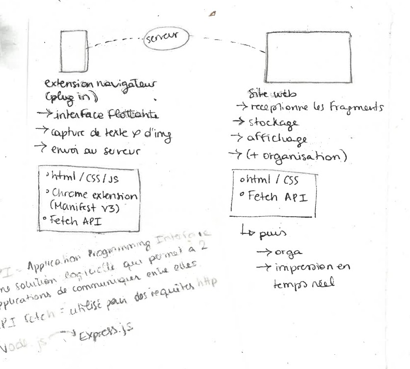
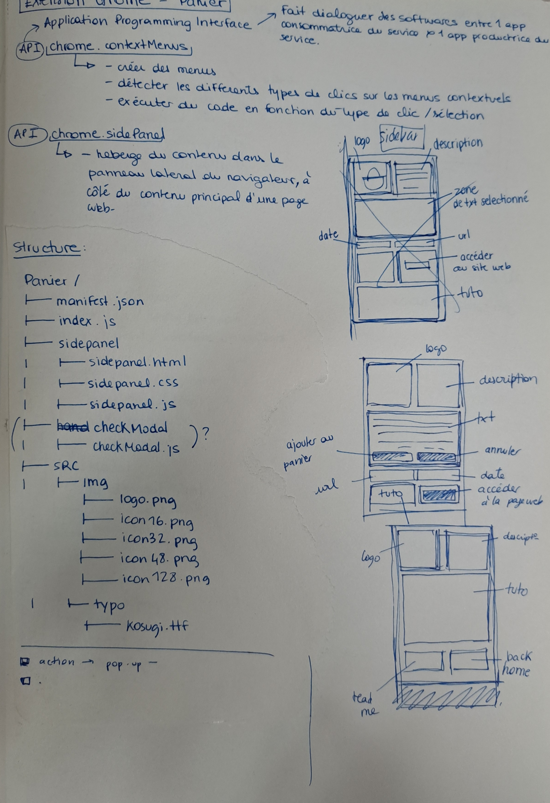
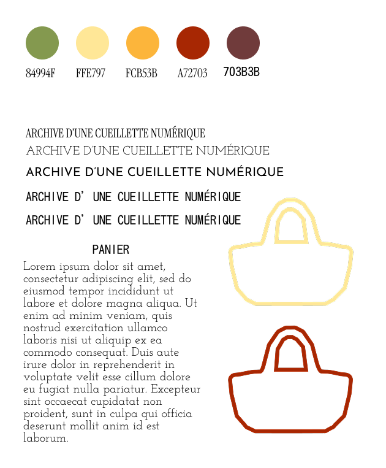
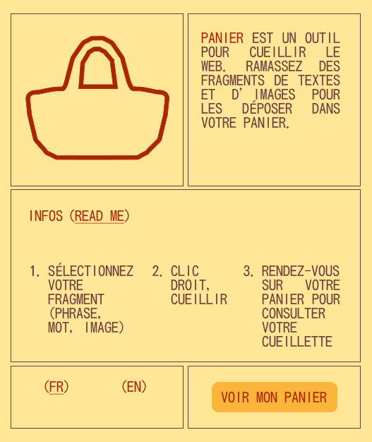

# Fiche pédagogique

***

## I) Information étudiant :

- **Nom** : Bouvard

- **Prénom** : Adèle 

### Profil & connaissances :

#### Présentation personnelle

Je suis particulièrement intéressée par le design éditorial, la production de support de médiation et d'articles plus théorique. Je me dirige assez naturellement vers un travail de graphisme (en maison d'édition par exemple) ou même de muséographie (j'aime particulièrement l'Histoire des arts). La découverte du monde numérique en DAD m'invite également à m'intéresser au monde du webdesign mais je ne pense pas en faire ma carrière. Tous les outils numériques que j'ai pu prendre en main au cours de ces deux dernières années sont pour autant des atouts pour la suite de mon parcours. Je suis intéressée par la transmission et être professeure me plairait également. Bref, c'est flou.

#### Compétences

- **Coding** : 10 - *je pense être plutôt à l'aise avec les langages html et CSS mais le reste est compliqué pour moi pour l'instant.*

- **Git & versionning** : 12 - *J'utilise de plus en plus GitHub et souhaite en faire un outil de travail, j'aime beaucoup*

- **Intéractivité & rendu temps réel** : 9 - *J'ai peu d'expérience là-dedans*

- **Graphisme & design d'interface** : 15 - *Je me considère à l'aise dans la création de projets graphiques en général mais il me manque encore beaucoup d'expérience et de connaissances*

- **Installation & mise en espace** : 14 - *J'aime mettre en espace mes travaux et je pense réussir à créer des installations claires et lisibles mais je ne sais pas faire de choses impressionnantes et je n'ose pas prendre tout l'espace (du sol au plafond)*

- **Présentation & argumentation** : 13 - *La théorie et l'argumentation de mes projets sont pour la plupart assez fournis mais je ne suis pas la plus à l'aise à l'oral, j'ai tendance à arrêter de respirer pendant mes présentations. Pour autant, je pense savoir me faire comprendre et répondre aux questions*

___

## II) Projet(s) & Thématique de recherche

# PROJET 1

#### Sujet :

- **Titre** : Archive d'une cueillette numérique 

- **Description** : L'outil fonctionne à travers deux formes; une extension web (la cueillette) et un site web (le panier). L'utilisateur peut activer l'extension dans son navigateur chrome afin de récupérer des fragments de web(textes, images...) avec le clic droit de sa souris. Ces fragments sont transférés vers le site internet pour les archiver. L'utilisateur peut les organiser comme il le souhaite ou les laisser flotter aléatoirement dans l'espace de la page. Une option "live" permet d'imprimer en temps réel l'archive de la cueillette de l'utilisateur. 

#### Thématiques de recherche :

- **La thématique que je souhaite explorer** : la création d'outil numérique et l'archive

- **pourquoi ?** : La création d'outil m'a vite intéressé, notamment après la découverte des projets [those.tools](https://www.those.tools/) impulsés par la Villa Hermosa. 

#### Outils & techniques :

- **Outils que je veux utiliser** : Html, Css, javascript, manifest.json, 

- **Outils que je veux maîtriser** : Extensions web (manifest.json), javascript  

#### Références Artistiques :

- **Argumentation théorique** : Nous vivons dans un flot d'informations et d'images continu qui nous "assomment". Selon Yves Citton notre attention devient la nouvelle ressource, si bien qu'il nous est compliqué de naviguer dans notre environnement numérique. Dans ce contexte, le geste de la cueillette devient un outil de résistance ; il s'oppose à la rapidité du "swipe" et nous invite a repenser nos rapports au web. Chercher, identifier, cueillir, ranger, classer, observer, cet outil transpose la méthodologie de la cueillette pour nous aider à recentrer notre attention là où on le souhaite vraiment. 

- **Références** : 
  - Yves Citton, *Pour une écologie de l'attention*, 2014 
  - Alison Knowles, *House of Dust*, 1967 
  - Lydia Chodosh et Donald Zhu, *On the impulse to notate*, 2024

____

## III) Actions

#### Contribution à un projet d'un autre étudiant

- échanges avec Arnaud autour de références (L'Association etc...)

- j'ai parlé de Colossal Cave de Ralph Witt à Suyeon par rapport au labyrinthe 

#### Contribution aux ressources

- blablabla

#### Accrochage de rendu

- blablablabla

____

## IV) Journal de bord

### lundi 3 novembre 2025

#### To-do list :

- [x]  création du fichier pédagogique et du repo github
- [X]  recherche des premières références  
  - [*Le livre infini*](https://albertinemeunier.net/livre-infini), Albertine Meunier  
  - [*The House of Dust*](https://www.cnap.fr/house-dust-alison-knowles), Alison Knowles, 1967  
  - [*Atlas critique d'internet*](https://louisedrulhe.fr/internet-atlas/), Louise Drulhe, 2015 
     
  - [*Pour une écologie de l'Attention*](https://www.yvescitton.net/wp-content/uploads/2020/08/Citton-EcologieAttentionPolitiquesDistractions-Dugnat-2018.pdf), Yves Citton,  
- [X]  articuler mon sujet de recherche  
  *Mon sujet de recherche va circuler autour du geste de la cueillette et notamment de la cueillette numérique*
- [X]  commencer une feuille de route du projet  
  *La feuille de route est un outil que j'utilise régulièrement pour mes projets, elle me permet de réunir tous les éléments techniques, contextuels et théoriques dans un même fichier (pdf ou md). Elle ressemble à une maquette.*

#### Idées :

Mes premières idées se sont tournées vers la production d'un livre (ou objet éditorial) augmenté, tout du moins hybride. J'ai choisi de faire le lien avec mes recherches personnelles qui gravitent autour du geste de la cueillette, qui m'apparaît comme une méthode utile plastiquement. Je vais créer un outil qui nous permettrait de faire l'archive de notre cueillette sur internet (mots, textes, images, vidéos, sons...). Mon objectif est de réfléchir à une installation intéressante qui mettrait en lumière nos gestes en temps réel. Que garde t-on ? 

### mardi 4 novembre 2024 

#### To-do list :

- [X]  Commencer le développement d'une interface sur papier & sur figma
  - première [maquette](https://www.figma.com/proto/KRvKt46CpvPyjllykimAIf/Archive-d-une-cueillette-num%C3%A9rique?node-id=1-2&p=f&t=XatMt3URCoCIEIk1-1&scaling=scale-down-width&content-scaling=fixed&page-id=0%3A1) rapide   
- [X]  Réfléchir à la dynamique du plug-in + du site web (voir schéma)
- [X]  Recherche de réfs de site web
  - [*On the impulse to notate*](https://notations.xyz/text), designé par Lydia Chodosh et développé par Donald Zhu 
  - [*When we love*](https://whenwe.love/#updates), Chia Amisola,
- [X] Références en tous genres
  - la pratique du *digital garden*
  - la pratique du *perma computing*

#### Idées : 

 

Premier schéma du fonctionnement de mon outil de cueillette numérique :  
  - l'utilisateur est **acteur** de sa cueillette : il choisit les **mots** ou les **images** qu'il souhaite cueillir en séléctionnant avec sa souris.  
  - Ces collectes sont accompagnées de **méta-données** (données fantômes) : l'heure, la date et le chemin (url)  
  - le plug-in intéragit avec l'utilisateur : séléction des mots avec la souris puis exportation de la séléction vers le site web   
  - le site web incarne le rôle du "panier de cueillette", où l'on archive, ordonne et classe ce que l'on ramasse   
  - le site pourrait avoir un bouton "live" qui imprimerait en direct le site et sa cueillette

### vendredi 7 novembre 2025 

#### To-do list : 

- [X] Création d'un planning de travail pour les jours restants
  - voir le programme [ici](programme.md) 
- [X] Premiers tests de plug-in et de site avec Chat Gpt 
- [X] Réflexions autour des techniques & langages pour la création du projet 

#### Idées : 

Premiers tests de plug-in, premières pistes de langages et techniques avec chat gpt + recherches, découverte des ressources autour des extensions de [chrome](https://developer.chrome.com/docs/extensions?hl=fr)... 

### Lundi 24 novembre 2025 & mardi 25 novembre 2025

#### To-do list : 

- [X] Poursuivre maquette plug in + webpage
- [X] Finir de designer le plug-in (le clic droit & la page info)
- [X] Refs / Ressources intéressantes pour le plug-in (side panel ?) : 
  - [*Tango*](https://chromewebstore.google.com/detail/tango-%E2%80%93-document-and-auto/lggdbpblkekjjbobadliahffoaobaknh?hl=en&authuser=1&pli=1) 
  - [*20 Understanding Chrome Extensions Side Panel*](https://m2kdevelopments.medium.com/20-understanding-chrome-extensions-side-panel-334ef5de7cfd), Medium 

#### Idées : 

J'ai exploré et essayé de comprendre les bases d'un plug-in à travers cette template :  [*Context Menus Sample*](https://github.com/RobinMorettiBookmarkText-chromeExtension). Cela sera la base du projet 

